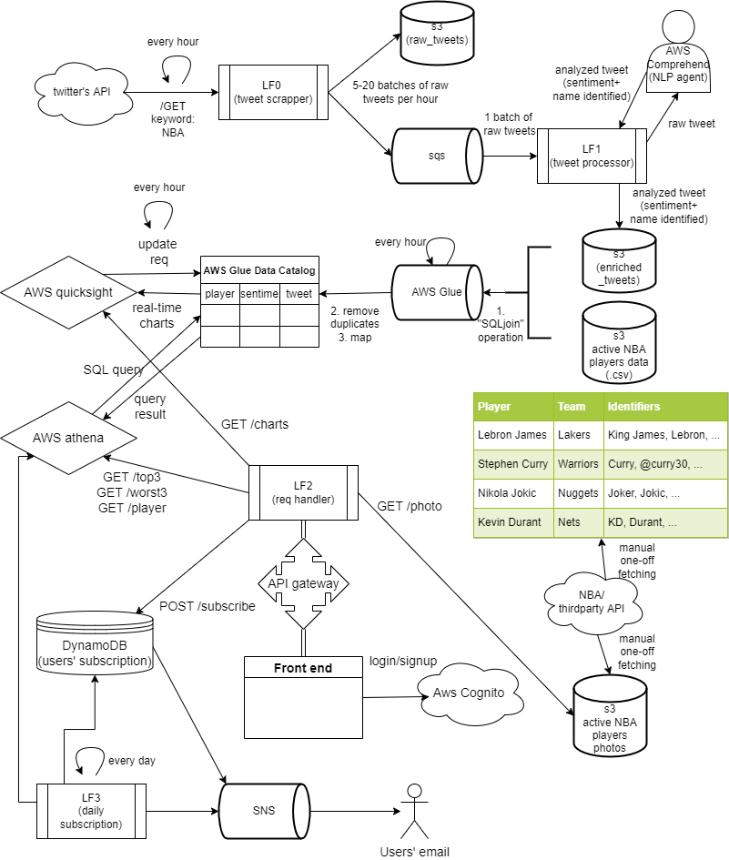

# TO DO (Everyone please update here from time to time)
1. Expose all API endpoints to the frontend via API Gateway (assigned to Mark)
- /GET topplayers (params: count=3, sentiment='ALL', hours=24, includeTweets=True, includePrevRank=True)
- /GET player (params: fullname="")
- /GET charts
- /POST subscribe (body: { user:"email", players:["Fullname","Fullname"] })
2. Add user personalization and allow users to subscribe to get updates about their favorite players 
- Write the backend logic to auto generate daily player report (assigned to Mark)
- Integrate SNS/SES that sends the daily player reports to a list of email addresses (assigned to Mark)
- Write the backend logic to store/maintain the user subscription details (assigned to Mark)
- Set up AWS Cognito (assigned to ?. Half-way done, contact Mark for more details)
3. NBA data scraping (assigned to ?)
- Create a more comprehensive table for the current NBA players. One-off manual effort is needed
- Currently only 2 columns (Fullname, Nicknames), we need (Fullname, Nicknames, PhotoS3Url, Team)
- Third-party NBA API may be helpful
- Need to identify more nicknames (refer to ./nba_data/nba player.csv)
- Need to map players to team (we want only active players) 
- Need to download & store players' photos in S3. The most popular 30~50 will suffice. 
- Expose /GET photo (params: fullname="") which returns the S3Url for the photo of a specific player. The frontend will need it.
4. Front end (assigned to Dhruvin)
- Frontend integrate AWS Cognito for login/signup (assigned to Dhruvin. Half-way done, contact Mark for more details)
- Mark has already written some code for the frontend in React. Check the front-end github repo for reference.

# NBA Players Tweets Sentiment Real-time Analytics
We want to generate and maintain in real-time the lists of the top 3 currently most loved and top 3 currently most hated NBA players on earth

-As NBA geeks, we want to know which players are currently the fans’ favorites, and which players are currently the most hated player on earth (probably Russell Westbrook right now)
-We sort of know from the news and from our daily conversations with friends. But can we quantify it?
-The list may change frequently, especially during the playoffs. So real-time analytics may be great!
-We want to see from the fans’ perspective. Number of fan tweets and their sentiment are our metrics. Players’ game stats are not our concern.

# Features
-Top 3 most liked players of the day/month
-Top 3 most hated players of the day/month
-See some of the recent tweets of the current top 3 most liked/hated players
-Past trends
-Find your player’s popularity ranking
-Subscribe to daily report about your favorite player

## Contributing
-Ho Shing Yam, Mark (hy2287@nyu.edu)

## System Design Diagram

## Links
[Front-end](https://nyu-final-proj-front-end.s3.amazonaws.com/index.html)
[Prototype](https://marvelapp.com/prototype/7f6c532/screen/85969524)
[Proposal](https://docs.google.com/document/d/1wvxu2ikUTOj7Iv4xydZlQcTS5IZ8J3_aaN4Ehx_FBcE/edit)
